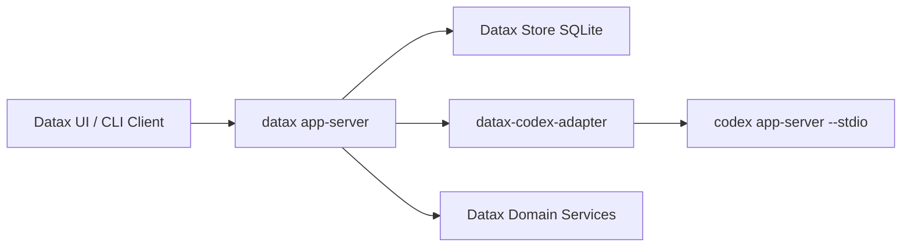

# Provisional Datax Migration Plan: External Codex Runtime Adapter

## Summary
Datax should be built as a new dedicated repository, not as a Codex fork. Codex remains a permanent downstream app-server/runtime, and Datax owns its public protocol, data model, persistence, domain workflows, and UI-facing concepts.

The migration strategy is:

- Datax public model: `Chat`, `Interaction`, `Message`.
- Codex downstream model: `Thread`, `Turn`, `Item`.
- Datax persists its own source of truth and stores Codex identifiers only as runtime links.
- Datax exposes no Codex `Thread` / `Turn` / `Item` concepts in normal client APIs.
- Datax integrates with Codex through a version-pinned adapter, initially using managed stdio JSON-RPC.

Discovery gate for this migration scope:

- Architecture discovery: complete.
- Implementation discovery: complete enough for v1 scaffold.
- Class A unresolved blockers: 0.
- Class B unresolved choices: 0, using defaults listed below.
- Allowed output type: provisional implementation-ready migration plan.

## Architecture
Target runtime shape:

Datax responsibilities:

- Own app-server protocol, request validation, auth/session context, persistence, domain state, scheduling metadata, deployment metadata, run metadata, monitoring views, and UI projections.
- Convert Datax `chat/start` and `interaction/start` calls into Codex `thread/start` and `turn/start` calls.
- Convert Codex notifications into persisted Datax `Message` records and interaction state transitions.
- Treat Codex as an execution/runtime service, not as Datax’s database or product model.

Codex responsibilities:

- Agentic coding/runtime behavior.
- Workspace-aware execution.
- Tool calling, file changes, command execution, plans, model streaming, and permission workflows.
- No direct ownership of Datax domain entities.

## Repository And Crate Plan
Create a greenfield Rust workspace for Datax with these initial crates:

- `datax-app-server-protocol`: public Datax JSON-RPC protocol and generated TypeScript types.
- `datax-app-server`: stdio app-server entrypoint, request router, notification fanout, lifecycle management.
- `datax-domain`: Datax domain entities and service traits.
- `datax-store-sqlite`: durable SQLite persistence, migrations, transactional repositories.
- `datax-codex-adapter`: only crate allowed to know Codex protocol names and wire shapes.
- `datax-runtime`: orchestration layer joining domain services, store, and runtime adapters.
- `datax-cli`: local launcher for `datax app-server --stdio`.

Codex dependency policy:

- Pin Codex integration to an explicit Codex git tag or commit.
- Keep the dependency private to `datax-codex-adapter`.
- Do not re-export Codex types from any Datax public crate.
- Maintain a compatibility matrix: `datax version -> supported codex commit/tag`.
- Add CI contract tests against every supported Codex version.

## Public API And Type Mapping
Datax app-server should follow the same broad JSON-RPC style as Codex app-server, but with Datax resource names.

Initial public methods:

- `initialize`
- `chat/start`
- `chat/read`
- `chat/list`
- `chat/archive`
- `chat/delete`
- `interaction/start`
- `interaction/interrupt`
- `message/list`
- `codex/status/read`
- `codex/restart`

Initial notifications:

- `chat/started`
- `chat/status/changed`
- `interaction/started`
- `interaction/completed`
- `interaction/failed`
- `message/created`
- `message/updated`
- `message/delta`
- `approval/requested`
- `approval/resolved`
- `codex/status/changed`

Core mapping:

| Datax | Codex | Rule |
|---|---|---|
| `Chat` | `Thread` | One Datax chat may link to one Codex thread. |
| `Interaction` | `Turn` | One user/model exchange maps to one Codex turn. |
| `Message` | `ThreadItem` / item events | Codex items are projected into Datax messages. |

Persist these Datax records:

- `Chat`: `id`, `title`, `workspace_id`, `status`, `created_at`, `updated_at`, optional `codex_thread_id`.
- `Interaction`: `id`, `chat_id`, optional `codex_turn_id`, `status`, `input`, `started_at`, `completed_at`, `error`.
- `Message`: `id`, `chat_id`, optional `interaction_id`, optional `codex_item_id`, `sequence`, `kind`, `role`, `content`, `status`, timestamps.
- `CodexRuntimeLink`: Datax object id, Codex object id, Codex version, cwd, permission profile, model/provider metadata.

Datax domain entities for later product features should be introduced as first-class Datax concepts, not Codex extensions:

- `Plan`
- `Workflow`
- `Deployment`
- `Schedule`
- `Run`
- `Monitor`
- `Artifact`
- `Approval`

## Codex Adapter Behavior
Use managed stdio for v1:

- Launch `codex app-server --stdio`.
- Perform `initialize` / `initialized` handshake.
- Capture stderr into Datax logs.
- Maintain adapter states: `starting`, `initializing`, `ready`, `degraded`, `restarting`, `stopped`.
- Use bounded request and notification queues.
- Add request timeouts and exponential backoff with jitter.
- On Codex overload or retryable errors, retry only idempotent reads automatically.
- Do not silently replay active turns after Codex process loss. Mark active Datax interactions as `runtimeLost` or `failed`.

Projection rules:

- Codex `thread/started` becomes Datax `chat/started`.
- Codex `turn/started` becomes Datax `interaction/started`.
- Codex `turn/completed` becomes Datax `interaction/completed`.
- Codex `item/*` notifications become Datax `message/*` notifications.
- Codex command execution, file change, tool call, plan, reasoning, and agent messages must each map to explicit Datax `MessageKind` variants.
- Unknown Codex item variants must be stored as `runtimeRaw` messages and surfaced only in debug/admin views.

## Implementation Phases
1. Create the Datax workspace skeleton, crate boundaries, CI, formatting, linting, and release metadata.
2. Define Datax app-server protocol with `Chat`, `Interaction`, `Message`, runtime status, pagination, and notification envelopes.
3. Implement SQLite migrations and repository traits for chats, interactions, messages, runtime links, and outbox events.
4. Implement the Codex stdio adapter with process supervision, handshake, request correlation, notification stream handling, timeout handling, and structured errors.
5. Implement projection from Codex events into Datax records and notifications.
6. Implement `datax app-server --stdio` end-to-end: initialize, start chat, start interaction, stream messages, persist state, read history.
7. Add Datax domain skeleton for plan/build/deploy/schedule/execute/monitor entities without coupling them to Codex types.
8. Add operational hardening: logs, metrics hooks, crash recovery, schema migration checks, compatibility tests, and release packaging.

## Tests And Acceptance Criteria
Required tests:

- Protocol schema tests for all public Datax request, response, and notification types.
- Mapper tests covering every known Codex `ThreadItem` variant with exhaustive matching.
- Golden fixture tests: Codex JSON events in, Datax messages out.
- SQLite migration tests from empty database to latest schema.
- Adapter unit tests with mocked JSON-RPC transport.
- Integration tests with a fake Codex app-server process.
- Optional real-Codex smoke test gated behind an environment variable.
- Restart tests proving active interactions are marked failed or runtime-lost.
- API lint test proving public Datax protocol does not expose `Thread`, `Turn`, or `Item`.

Acceptance criteria for v1:

- `datax app-server --stdio` can initialize successfully.
- A client can call `chat/start`, then `interaction/start`.
- Codex output streams back as Datax `message/*` notifications.
- Chat, interaction, message, and runtime-link state survive Datax restart.
- Datax works when Codex is unavailable by reporting degraded runtime status, not by crashing.
- No normal Datax API exposes Codex `Thread`, `Turn`, or `Item`.

## Production Risks And Mitigations
Codex protocol drift:

- Pin Codex versions.
- Add contract tests.
- Keep all Codex names inside `datax-codex-adapter`.

Event ordering and replay:

- Assign Datax monotonic message sequence numbers.
- Use idempotent upserts keyed by Codex item id where available.
- Persist raw event references for audit/debug.

Runtime failure:

- Supervise Codex child process.
- Mark active interactions explicitly on process loss.
- Avoid invisible turn replay.

Security:

- Datax owns workspace allowlists and permission profiles.
- Secrets must not be persisted in messages.
- Codex cwd and runtime workspace roots must be explicit per chat.

Data volume:

- Cap inline message content.
- Store large command output, logs, and artifacts as bounded artifacts referenced by messages.
- Add pagination from day one.

## Assumptions And Defaults
Chosen defaults for the provisional plan:

- Datax is a greenfield Rust workspace.
- Codex is always an external downstream runtime.
- v1 transport is managed stdio, not websocket.
- v1 persistence is SQLite.
- v1 is local/single-user first.
- Hosted or multi-user mode is a later architecture phase.
- Codex must be installed or configured by path.
- Datax owns `.datax`; Codex continues to own `.codex`.
- Experimental Codex APIs are disabled unless explicitly feature-gated inside the adapter.
